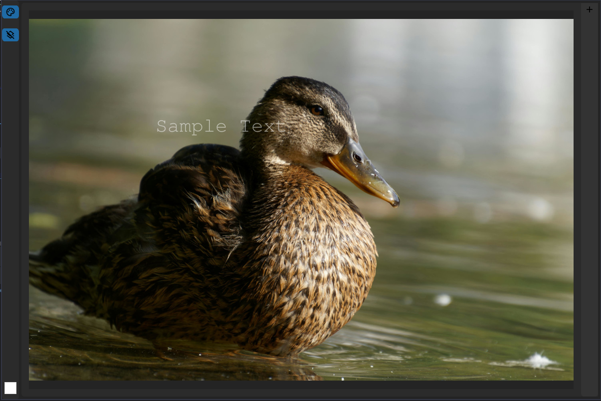
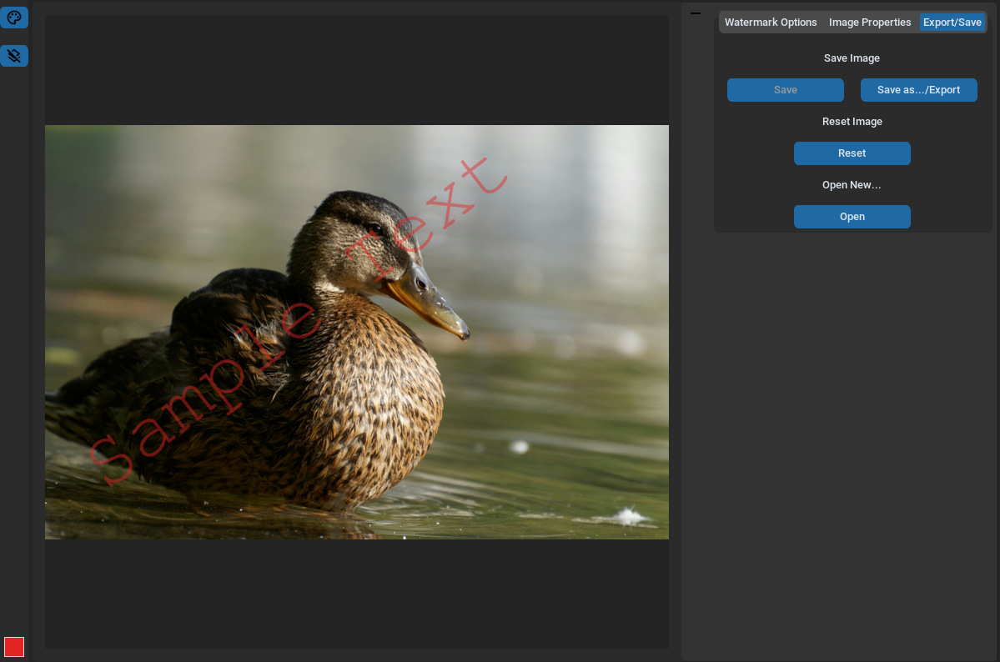

# Wtermarker *WIP*

A simple Custom Tkinter program to add watermarks to images.
Uses the PIL(Python Pillow) library to provide some basic image editing operations. Currently, supports 
JPEG and PNG. 

TO-DO:
* ~~Rearange GUI for better readabillity and add/improve options~~
* A~~dd dynamic image resize in canvas~~
~~* Add abilitty to flip image~~
~~* Fix dynamic image resize with window~~
* Fix movement on drag of watermark placed on preview image
* Add zoom/pan 

Work in Progress.

Image source: https://www.pexels.com/
